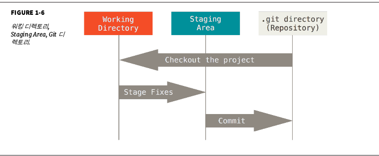

[Pro Git] CH1 시작하기

## 버전관리
버전 관리 시스템은 파일 변화를 시간에 따라 기록했다가 나중에 특정 시점의 버전을 다시 꺼내올 수 있는 시스템이다.

## Git의 기초
* 차이가 아니라 스냅샷을 저장
  * Git은 데이터를 파일 시스템 스냅샷으로 취급하고 크기가 아주 작다.
  * 성능을 위해 파일이 달라지지 않으면 이전 상태의 파일에 대한 링크만 저장한다.
* 대부분의 명령을 로컬에서 실행
  * 로컬에서 실행되므로 매우 빠르게 명령이 실행된다.
* 무결성
  * SHA-1 해시로 체크섬을 만든다.
* 데이터는 추가만 되며 삭제할 수 없다.
  * 일단 커밋하면 데이터를 되돌리거나 삭제할 수 없다.

## 세 가지 상태
Git의 모든 파일은 다음의 세 가지 상태를 가진다.
* Commited
* Modified
* Staged



* .git Directory - 메터데이터와 객체 데이터베이스를 저장
* Working Directory(워킹 디렉토리) - 프로젝트의 특정 버전을 checkout한 것
* Staging Area - .git 디렉토리 내부에 존재한다. 단순한 파일이며 곧 커밋할 파일에 대한 정보를 저장한다.

Git으로 하는 일은 기본적으로 다음과 같다.

1. 워킹 디렉토리에서 파일을 수정한다.
2. Staging Area에 파일을 Stage 해서 커밋할 스냅샷을 만든다.
3. Staging Area에 있는 파일들을 커밋해서 Git 디렉토리에 영구적인 스냅샷으로 저장한다.

Git 디렉토리에 있는 파일들은 Committed 상태이다. 파일을 수정하고 Staging Area에 추가했다면 Staged이다. 그리고 Checkout 하고 나서 수정했지만, 아직 Staging Area에 추가하지 않았으면 Modified이다.

## Git 설치
(생략)

## Git 설치 후 설정

<code>git config</code>를 통해 설정 내용을 확인하고 변경할 수 있다. <code>git config</code>가 참조하는 설정 파일은 총 3가지 이다.

1. /etc/gitconfig 파일: 
  * 시스템의 모든 사용자와 모든 저장소에 적용되는 설정이다. 
  * <code>git config --system</code> 옵션으로 이 파일을 읽고 쓸 수 있다.
2. ~/.gitconfig , ~/.config/git/config 파일
  * 특정 사용자에게만 적용되는 설정이다. 
  * <code>git config --global</code> 옵션으로 이 파일을 읽고 쓸 수있다.
3. .git/config : 
  * 이 파일은 Git 디렉토리에 있고 특정 저장소(혹은 현재 작업 중인 프로젝트)에만 적용된다.

각 설정은 역순으로 우선한다.

### 사용자 정보
```bash
$ git config --global user.name "John Doe"
$ git config --global user.email johndoe@example.com
```
프로젝트에서만 사용하고 싶은 이름과 이메일이 있으면 <code>--global</code> 옵션을 제거한다.

### 편집기
```bash
$ git config --global core.editor [editor name] # e.g. vim
```

### 설정 확인
<code>git config</code>를 통해 확인할 수 있다.

```bash
# 전체적인 설정 확인
$ git config --list
user.name=John Doe
user.email=johndoe@example.com
color.status=auto
color.branch=auto
color.interactive=auto
color.diff=auto
...
# 특정 옵션 확인 
# git config <key>
$ git config user.name
John Doe
```

-------
출처:

Pro Git 원본은 [git-scm](https://git-scm.com/book/en/v2)에서 확인 가능하며 한국어 사이트는 [이곳](https://git-scm.com/book/ko/v2)을 참고하시면 될 것 같습니다. pdf파일이 필요하신 경우 위 사이트에서 다운로드도 가능합니다.

<a rel="license" href="http://creativecommons.org/licenses/by-nc-sa/3.0/"></a><br />이 저작물은 <a rel="license" href="http://creativecommons.org/licenses/by-nc-sa/3.0/">크리에이티브 커먼즈 저작자표시-비영리-동일조건변경허락 3.0 Unported 라이선스</a>에 따라 이용할 수 있습니다.