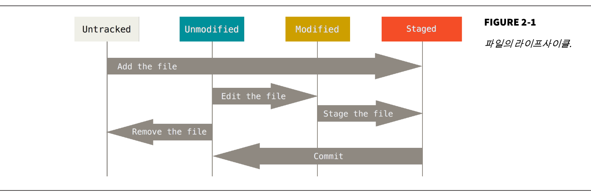

[Pro Git] CH2 Git의 기초

## Git 저장소 만들기
### 기존 디렉토리를 Git 저장소로 만들기
저장소를 만들고 싶은 폴더로 간 후 다음과 같은 명령어를 실행한다.

```bash
$ git init
```

이 명령어는 .git 디렉토리를 만든다. 이 폴더 안에는 뼈대 파일(Skeleton)이 들어있다. 이후에 Git이 파일들을 관리하게 하려면 <code>git add</code>와 <code>git commit</code> 명령으로 커밋해야 한다.

```bash
$ git add *.c
$ git add LICENSE
$ git commit -m 'initial project version'
```
### 기존 저장소를 Clone 하기
<code>git clone [url]</code> 을 실행하면 프로젝트 히스토리를 전부 받아온다.

```bash
$ git clone https://github.com/libgit2/libgit2 
```
이 명령은 “libgit2”이라는 디렉토리를 만들고 그 안에 .git 디렉토리를 만든다. 그리고 저장소의 데이터를 모두 가져와서 자동으로 가장 최신 버전을
Checkout 해 놓는다.

```bash
$ git clone https://github.com/libgit2/libgit2 mylibgit
```
위와 같이 폴더명을 지정할 수도 있다.

## 수정하고 저장소에 저장하기
파일의 상태는 크게 다음과 같이 나눌 수 있다.
* Tracke
  * Unmodified
  * Modified
  * Staged
* Untracked

마지막 커밋 이후 아직 아무것도 수정하지 않은 상태에서 어떤 파일을 수정하면 Git은 그 파일을 Modified 상태로 인식한다.



### 파일 상태 확인하기
<code>git status</code> 명령어를 사용한다.
```bash
# git clone하자마자 바로 git status를 실행한 경우 
$ git status
On branch master
nothing to commit, working directory clean
```

README 파일을 예시로 만들어 본다.
```bash
$ echo 'My Project' > README
$ git status
On branch master
Untracked files:
(use "git add <file>..." to include in what will be committed)
README
nothing added to commit but untracked files present (use "git add" to track)
```

### 파일을 새로 추적하기
<code>git add</code> 명령어로 파일을 새로 추적할 수 있다.
```bash
$ git add README
$ git status
  On branch master
  Changes to be committed:
  (use "git reset HEAD <file>..." to unstage)
  new file: README
```

### Modified 상태의 파일을 Stage 하기
```bash
$ git add benchmarks.rb
$ vim benchmarks.rb # 수정했다고 가정
$ git status
  On branch master
  Changes to be committed:
    (use "git reset HEAD <file>..." to unstage)
    new file: README
    modified: benchmarks.rb
    
  Changes not staged for commit:
    (use "git add <file>..." to update what will be committed)
    (use "git checkout -- <file>..." to discard changes in working directory)
    modified: benchmarks.rb
```

benchmarks.rb 가 Staged 상태이면서 동시에 Unstaged 상태로 나온다. 지금 이 시점에서 커밋을 하면 <code>git commit</code> 명령을 실행하는 시점의 버전이 커밋되는 것이 아니라 마지막으로 <code>git add</code> 명령을 실행했을 때의 버전이 커밋된다.

### 파일무시하기
.gitignore 파일에 무시할 파일, 디렉토리를 입력한다.

#### .gitignore 입력 패턴
* 아무것도 없는 라인이나, # 로 시작하는 라인은 무시한다.
* 표준 Glob 패턴을 사용한다.
* 슬래시( / )로 시작하면 하위 디렉토리에 적용되지(Recursivity) 않는다.
* 디렉토리는 슬래시( / )를 끝에 사용하는 것으로 표현한다.
* 느낌표( ! )로 시작하는 패턴의 파일은 무시하지 않는다.

#### Glob 패턴

|기호|의미|
|:---|:----|
|*(애스터리스크)|문자가 하나도 없거나 하나 이상을 의미|
|[abc]|중괄호 안에 있는 문자 중 하나|
|?|문자 하나|
|[0-9]|하이픈을 이용하면 그 문자 사이에 있는 문자 하나를 말함|
|**|디렉토리 안에 디렉토리까지 지정|

아래는 .gitignore의 예시들이다.
```text
# 확장자가 .a인 파일 무시
*.a
# 윗 라인에서 확장자가 .a인 파일은 무시하게 했지만 lib.a는 무시하지 않음
!lib.a
# 현재 디렉토리에 있는 TODO파일은 무시하고 subdir/TODO처럼 하위디렉토리에 있는 파일은
/TODO
# build/ 디렉토리에 있는 모든 파일은 무시
build/
# doc/notes.txt 파일은 무시하고 doc/server/arch.txt 파일은 무시하지 않음
doc/*.txt
# doc 디렉토리 아래의 모든 .txt 파일을 무시
doc/**/*.txt
```

### Staged와 Unstaged 상태의 변경 내용을 보기
단순히 파일이 변경됐다는 사실이 아니라 어떤 내용이 변경됐는지 살펴보기엔 git status 명령이 아니라 git diff 명령을 사용해야 한다.
```bash
$ git diff
  diff --git a/benchmarks.rb b/benchmarks.rb
  index 3cb747f..e445e28 100644
  --- a/benchmarks.rb
  +++ b/benchmarks.rb
  @@ -36,6 +36,10 @@ def main
             @commit.parents[0].parents[0].parents[0]
            end
  +         run_code(x, 'commits 1') do
  +         git.commits.size
  +         end
  +    
            run_code(x, 'commits 2') do
            log = git.commits('master', 15)
            log.size
```

만약 커밋하려고 Staging Area에 넣은 파일의 변경 부분을 보고 싶으면 git diff --cached 또는 --staged 옵션을 사용한다.
```bash
$ git diff --staged
  diff --git a/README b/README
  new file mode 100644
  index 0000000..03902a1
  --- /dev/null
  +++ b/README
  @@ -0,0 +1,4 @@
  +My Project
  +
  + This is my project and it is amazing.
  +
```

> **(주의)** git diff 명령은 마지막으로 커밋한 후에 수정한 것들 전부를 보여주지 않는다. git diff 는 Unstaged 상태인 것들만 보여준다.

> 외부도구로 비교하기<br>git diff를 사용할 수도 있지만 외부도구를 사용할 수도 있다. git diff 대신 git difftool 명령을 사용해서 Araxis, emerge, vimdiff 같은 외부 도구로 비교할 수 있다. git difftool --tool-help 라는 명령은 사용가능한 도구를 보여준다.

### 변경 사항 커밋하기
```bash
$ git commit
$ git commit -m "Story 182: Fix benchmarks for speed" # 커밋 메시지 
```

### Staging 하지 않고 바로 커밋하기
-a 옵션을 추가한다.

```bash
$ git commit -a -m 'added new benchmarks'
```

### 파일 삭제하기
Git에서 파일을 제거하려면 git rm 명령으로 Tracked 상태의 파일을 삭제한 후에(정확하게는 Staging Area에서 삭제하는 것) 커밋해야 한다. 이 명령은 워킹 디렉토리에 있는 파일도 삭제하기 때문에 실제로 지워진다.

만약 Git없이 그냥 파일을 삭제하고 git status 명령으로 상태를 확인하면 “Changes not staged for commit”(즉, Unstaged) 에 속한다는 것을 확인할 수 있다.
```bash
$ rm grit.gemspec
$ git status
```
그리고 git rm 명령을 실행하면 삭제한 파일은 Staged 상태가 된다.
```bash
$ git rm grit.gemspec
  rm 'grit.gemspec'
$ git status
  On branch master
  Changes to be committed:
      (use "git reset HEAD <file>..." to unstage)
      deleted:      grit.gemspec
```

Staging Area에서만 제거하고 워킹 디렉토리에 있는 파일은 지우지 않고 남겨둘 수 있다. --cached 옵션을 사용하여 명령을 실행한다.
```bash
$ git rm --cached README
```

여러 개의 파일이나 디렉토리를 한꺼번에 삭제할 수도 있다. 아래와 같이
git rm 명령에 file-glob 패턴을 사용한다.
```bash
$ git rm log/\*.log
```

## 커밋 히스토리 조회하기
```bash
git log
```

* 특별한 argument 없이 `git log`를 실행하면 커밋 히스토리를 시간순으로 보여줌
  * 커밋의 해시값, 저자이름, 저자 이메일, 커밋 날짜, 커밋 메시지

### `git log` 옵션

원하는 히스토리를 검색할 수 있도록 다양한 옵션들을 지원한다.

`-p` 또는 `--patch`는 각 커밋의 diff 결과를 보여준다. 가장 유용하게 사용된다. 예를 들어 `git log -p -2`라는 명령어는 최근 2개의 diff 결과를 보여준다. 
또한 이 옵션은 diff 명령어를 실행한 결과와 동일하기 때문에 동료가 무엇을 커밋하고 리뷰했는지 빨리 조회하는데 유용하다.

`git log --stat`은 갓 커밋의 통계정보를 조회할 수 있다.
얼마나 많은 파일이 변경됐는지, 얼마나 많은 라인을 추가하거나 삭제했는지 확인 가능하다.

`git log --pretty` 옵션은 히스토리 내용을 볼 때 기본 출력 형식 외의 여러가지 중 하나를 선택할 수 있다. `oneline`은 각 컷미을 한 라인으로 보여주며 `short`, `full`, `fuller` 옵션은 정보들을 조금씩 가감해서 보여준다.

`git log --pretty=online` 방식으로 쓸 수 있다.

`git log --pretty=format:"%h - %an, %ar : $s"`는 지정한 포맷으로 출력할 수 있다. `foramt`에서 사용할 수 있는 옵션들은 [여기](https://git-scm.com/book/ko/v2/Git%EC%9D%98-%EA%B8%B0%EC%B4%88-%EC%BB%A4%EB%B0%8B-%ED%9E%88%EC%8A%A4%ED%86%A0%EB%A6%AC-%EC%A1%B0%ED%9A%8C%ED%95%98%EA%B8%B0#pretty_format)서 확인할 수 있다.

저자(author)와 커밋터(committer)는 다른 사람일 수 있다. 자세한 내용은 [분산환경에서의 Git](https://git-scm.com/book/ko/v2/ch00/ch05-distributed-git)에서 확인할 수 있다.

`oneline`과 `format`옵션은 --graph 옵션을 함께 사용할 때 유용하다. branch와 merge 히스토리를 보여주는 아스키 그래프를 출력한다.

```bash
git log --pretty=format:"%h %s" --graph
```

git log의 다양한 옵션들은 [여기](https://git-scm.com/book/ko/v2/ch00/log_options)에서 확인할 수 있다.

### 조회 제한 조건
`--since`나 `--until`와 같이 시간을 기준으로 조회하는 옵션은 매우 유용하다. 예를 들어 지난 2주동안 만들어진 커밋들만 조회하는 명령은 `git log --since=2.weeks`다. 옵션으로 `"2018-01-14"`와 같은 정확한 날짜를 사용할 수도 있고 `"2 years 1 day 3 minutes ago"`와 같이 상대적인 기간을 사용할 수도 있다.

`--author` 옵션으로 저자를 지정하여 검색할 수도 있고 `--grep` 옵션으로 커밋 메시지에서 키워드를 검색할 수도 있다.

`-S` 옵션은 코드에서 추가되거나 제거된 내용 중 특정 텍스트가 포함되어있는지를 검색한다. 예를 들어 어떤 함수가 추가되거나 제거된 커밋만을 알아보려면 아래와 같은 명령을 사용한다.

```bash
git log -S function1
```

파일 경로로 검색하는 옵션도 있도 유용하게 사용될 수 있다. 디렉토리나 파일 이름을 사용하여 그 파일이 변경된 log의 결과를 검색할 수 있다. `--`을 사용한다.

```bash
git log -- /home/user1/project1/src/utils /home/user1/project1/src/core
```

조회 범위를 제한하는 더 많은 옵션들은 [여기](https://git-scm.com/book/ko/v2/ch00/limit_options)를 참고하면 된다.

## 되돌리기(undo)

### 커밋 수정하기
너무 일찍 커밋했거나 파일을 빼먹었거나 커밋메시지를 잘못 적은 경우 커밋을 수정할 수 있다.

```bash
git commit --amend
```

이 명령은 staging area를 사용하여 커밋한다. 마지막으로 커밋하고 수정된 것이 없다면 조금 전 커밋과 모든것이 같으므로 커밋 메시지만 수정한다.

### 파일 상태를 unstage로 변경하기
```bash
git reset HEAD CONTRIBUTING.md # example
```
이용한다.
> `git reset`은 매우 위험하다. 특히 `--hard` 옵션과 함꼐 사용하면 더욱 위험하다. 위처럼 옵션 없이 사용하면 워킹 디렉토리의 파일은 건드리지 않는다.

`reset` 명령이 어떻게 동작하는지는 [여기](https://git-scm.com/book/ko/v2/ch00/_git_reset)서 확인할 수 있다.

### 수정된 파일 되돌리기
어떤 파일을 지난 커밋이 완료된 상태로 되돌리고 싶을 때는 `checkout`을 이용한다.

```bash
git checkout -- CONTRIBUTING.md
```

> `checkout` 명령을 이용하여 파일을 되돌리는 것은 매우 위험하기 떄문에 사용시 주의를 요한다.

---
수정한 내용을 쉽게 버릴 수는 없고 당장은 되돌려야 된다면 Stash와 Branch를 사용하자. 

Git으로 **커밋**한 모든 것은 언제나 복구할 수 있다. 삭제된 브렌치에 있던 것도 `--ammend` 옵션으로 다시 커밋한 것도 복구할 수 있다.(자세한 것은 [데이터 복구](https://git-scm.com/book/ko/v2/ch00/_data_recovery)에서 다룬다.

## 리모트 저장소(원격 저장소)
### 리모트 저장소 확인하기
`git remote`로 확인 가능하다. `git clone`으로 저장소를 clone하면 자동으로 `origin`이라는 리모트 저장소가 자동으로 등록된다. `-v` 옵션을 주면 이름과 url을 같이 볼 수 있다.

```bash
$ git remote
origin
$ git remote -v
origin	https://github.com/schacon/ticgit (fetch)
origin	https://github.com/schacon/ticgit (push)
```

리모트 저장소와 데이터를 주고받는데 사용되는 다양한 프로토콜은 [서버에 Git 설치하기](https://git-scm.com/book/ko/v2/ch00/_getting_git_on_a_server)에서 자세히 확인 가능하다.

### 리모트 저장소 추가
기존 워킹 디렉토리에서도 리모트 저장소를 추가할 수 있다. `git remote add <별명> <url>` 명령을 사용한다. 
```bash
$ git remote add pb https://github.com/paulboone/ticgit
$ git remote -v
origin	https://github.com/schacon/ticgit (fetch)
origin	https://github.com/schacon/ticgit (push)
pb	https://github.com/paulboone/ticgit (fetch)
pb	https://github.com/paulboone/ticgit (push)
```

url대신 `pb`라는 이름을 사용할 수 있다. 예를 들어 다음은 pb의 저장소에서 파일을 가져오는 명령어다.

```bash
$ git featch pb
```

### 리모트 저장소에 pull하거나 fetch하기
`git fetch <remote>` 명령어를 통해 가능하다. 리모트 저장소의 모든 데이터를 모두 로컬로 가져오지만 자동으로 merge를 하지는 않는다. 작업을 정리하고 수동으로 merge해야 한다.

`git pull` 명령을 사용하면 리모트 저장소 브랜치 데이터를 가져올 뿐 아니라 자동으로 로컬 브랜치와 merge시킨다.

### 리보트 저장소에 push하기
`git push <remote> <branch>`를 사용하면 된다.

`git push origin master`는 clone한 리모트 저장소에 쓰기 권한이 있고, clone한 하고 난 이후 아무도 upstream 저장소에 push를 하지 않았을 떄만 사용할 수 있다. 다시 말해 clone한 사람이 여러 명 있을 떄 다른 사람이 push 한 후에 push하려고 하면 push를 할 수 없다. 다른 사람이 작업한 것을 먼저 가져와서 merge한 후 push를 할 수 있다.

### 리모트 저장소 살펴보기
```bash
$ git remote show <remote>
```
### 리모트 저장소 이름 바꾸기, 삭제하기
```bash
# rename
$ git remote rename pb paul
# deletion
$ git remote remove paul
$ git remote rm paul
```

## 태그
### 태그 조회하기
```bash
$ git tag
# 패턴으로 검색
$ git tag -l "v1.8.5*"
```

### 태그 붙이기
크게 두 종류가 있다
* Lightweight: 브랜치와 비슷하나 브랜치를 가리키는 지점을 최신 커밋으로 이동시키지 않는다. 단순히 특정 커밋에 대한 포인터이다.
* Annotated: Git 데이터베이스에 태그를 만든 사람의 이름, 이메일과 태그를 만든 날짜, 태그 메시지를 저장. GPG로 서명할 수도 있다. 일반적으로 Annotated 태그를 만들어 이 모든 정보를 사용할 수 있도록 하는 것이 좋다. 그러나 임시로 생성하는 태그나 정보를 유지할 필요가 없는 경우에는 Lightweight태그를 사용할 수도 있다.

Annotated 태그를 만드는 방법은 `-a` 옵션을 추가하는 것이다.

```bash
git tag -a v1.4 -m "my version 1.4"
# -m 은 메시지를 저장
# 이 옵션을 주지 않으면 git은 편집기를 실행시킨다.
```

`git show` 명령으로 태그 정보와 커밋 정보를 모두 확인할 수 있다. 예를 들어, `git show v1.4`와 같은 방법으로 사용할 수 있다.

Lightweight 태그를 만드려면 옵션을 주지않고 사용하면 된다.

```bash
git tag v1.4-lw
```

Lightweight 태그에 `git show` 를 실행하면 커밋정보만 확인할 수 있으며 별도의 정보를 확인할 수 없다.

### 예전 커밋에 태그하기
```
$ git tag -a v1.2 9fceb02
```
체크섬을 이용해서 예전 커밋에도 태그를 달 수 있다.

### 태그 공유하기
`git push` 명령은 자동으로 태그를 리모트 서버로 전송하지는 않는다. 태그를 만들었으면 서버에 별도로 push해야 한다.

```bash
$ git push origin v1.5
```

한 번에 여러개 태그를 보내려면 `--tags` 옵션을 준다.

```bash
$ git push origin --tags
```

### 태그 checkout 하기
`git checkout <tag>`를 통해 특정 태그가 가리키는 커밋으로 체크아웃 할 수 있다. 단, 태그를 체크아웃하게 되면 **detached HEAD** 상태가 되며 git 관련 작업이 브랜치에서 작업하는 것과 다르게 동작할 수 있다.

**detached HEAD** 상태에서 작업하고 커밋을 만들면 태그는 그대로 있지만 새로운 커밋에 접근할 수 있는 방법이 없다. 따라서 새로운 브랜치를 만들어서 작업하는 것이 좋다.

```bash
$ git checkout -b version2
```

## Git Alias


---
출처:

Pro Git 원본은 [git-scm](https://git-scm.com/book/en/v2)에서 확인 가능하며 한국어 사이트는 [이곳](https://git-scm.com/book/ko/v2)을 참고하시면 될 것 같습니다. pdf파일이 필요하신 경우 위 사이트에서 다운로드도 가능합니다.

<a rel="license" href="http://creativecommons.org/licenses/by-nc-sa/3.0/"></a><br />이 저작물은 <a rel="license" href="http://creativecommons.org/licenses/by-nc-sa/3.0/">크리에이티브 커먼즈 저작자표시-비영리-동일조건변경허락 3.0 Unported 라이선스</a>에 따라 이용할 수 있습니다.